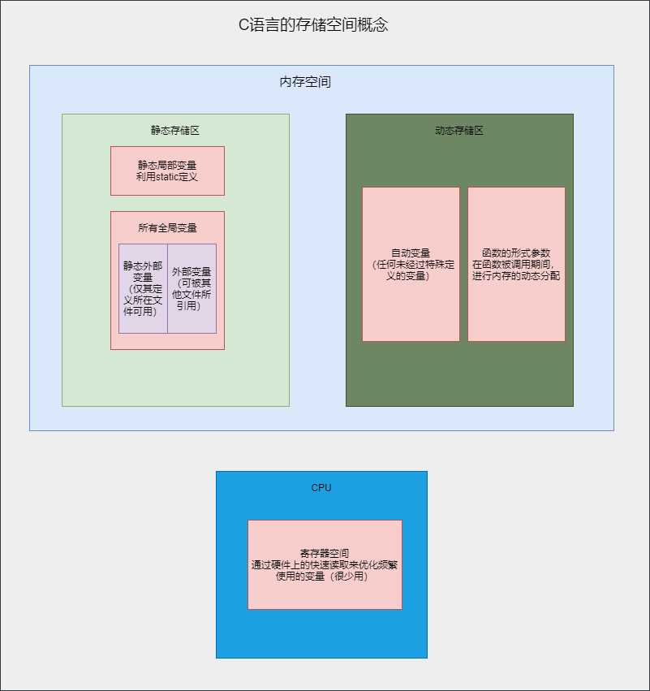
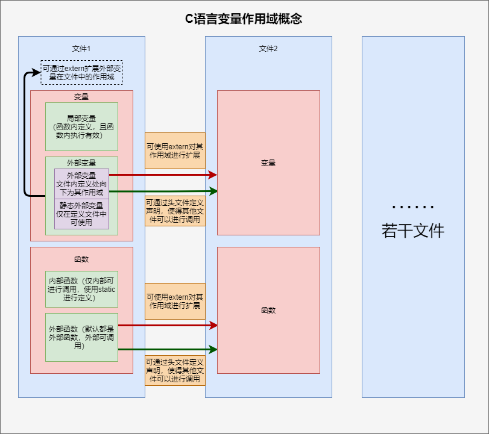
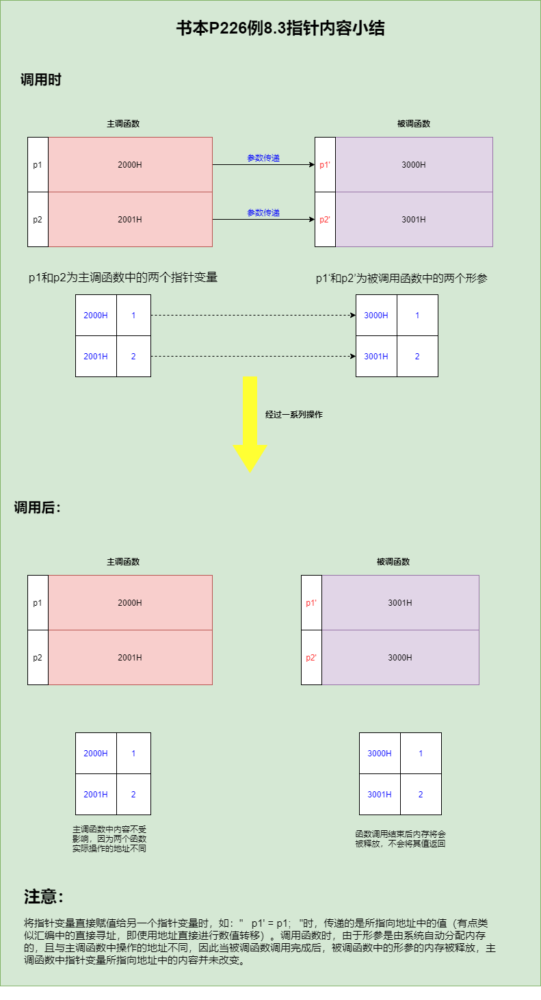

# 
$\color{red}{Part1:C语言程序设计易错点汇总}$
## 1.scanf()函数设置输入变量时不要忘记“&”
## 2.switch()的分支中不要漏掉break
## 3.语句结束的 ；
## 4.使用double定义变量时，输入输出数据时应当使用%lf格式
## 5.switch多分支选择语句中：一个case只能对应一个值一种情况，一定要是（常量）具体的数值或字符
## 6.%运算符的两个操作数必须是整型变量，不能为浮点型
## 7.当if语句发生嵌套时，若if和else所包括内容不加括号，if和else就近成对（P112 Q7）
## 8.当while后面的判断表达式的第一次值为“真”时，两种循环的结果相同，否则两种结果不同
## 9. == 才是“等于”
## 10.for(表达式1；表达式2；表达式3)中，若循环变量是在表达式1中定义的，那么循环变量的作用域仅仅只是在循环体中，循环外不能进行使用
## 11.一般如果某一变量将会数据预测过大，就直接使用double型进行定义
## 12.遇到需要小数就直接用double型
## 13.变量可能处于分母位置时，应当将变量设为double型
## 14.%s作为格式化输入时，不用在输入对象前加入'&'
## 15.系统将空格字符作为输入的字符串之间的分隔符。因此，倘若字符串中有使用多个空格字符进行分隔，则实际相当于输入了多个字符串
## 16.C语言中使用strcmp()来比较字符串的大小(具体字符串的大小比较规则见P163)
## 17.C语言中不能使用赋值语句将一个字符串常量或字符数组直接给一个字符数组，进行字符串之间的赋值，应当使用strcopy()(会将'\0'也复制过去)
## 18.二维数组a[i][j]的单独行a[i]可作为一维数组单独进行使用
## 19.今后输入字符串都使用gets()函数来进行输入
## 20.关于gets()与scanf("%s",str)的区分:
    gets():
    （1）gets() 从标准输入设备读取字符串，以回车结束读取，使用'\0'结尾，回车符'\n'被舍弃没有遗留在缓冲区。
    （2）可以用来输入带空格的字符串。
    （3）可以无限读取，不会判断上限，因此使用gets不安全，可能会造成溢出
    （4）gets的形参中需要加入作为buffer的数组名（不能是没有指向的指针变量）
    scanf():
    （1)scanf() 以 空格 或 回车符 结束读取，空格 或 回车符 会遗留在缓冲区。
    （2）不能直接输入带空格的字符串。

    注意：scanf()函数如何才能输入带空格的字符串，应使用:
    scanf("%[^\n]", a);  //%[]输入字符集, [^\n] 表示除了'\n'之外的字符都接收，即可以接收空格，这个可以用来输入带空格的字符串
    
    补充：关于gets与scanf()混合使用的问题
    1、gets在scanf前调用，这种调用一般不会出现什么问题，可以正常输入。
    2、scanf在gets前调用，这种情况就会出现问题，当输入完scanf中的变量时，运行到gets函数，则不让输入任何字符，出现此问题的原因是gets函数接收了scanf输入完后的回车符，解决的办法是在scanf和gets中间，用getchar函数接收掉回车符，这样就不会出现任何问题了。代码如下：
    char S[100];
    char a;
    scanf("%c",&a);
    getchar();
    gets(S);
## 21.==递归调用==
## 定义：在调用一个函数的过程中又出现直接或者间接地调用该函数本身，称为函数的递归调用。   
## 原理：递归调用的过程分为“回溯”与“递推”，递归调用中应当有结束递归过程的条件，不能使得递归调用无止境的进行下去
## 关键点：递归的重点就是要设计出来递归表达式
## 22.函数声明时一律直接用函数头，则不会引起具体数据类型的混淆（原因：见课本P194）
## 23.子函数中的形参数据可以不指定大小，在定义数据名后面加一个空的方括号即可
## 24.数组名作为函数参数时，传递的是数组的首元素地址
## 25.在定义二维及以上数组作为函数的实参或者形参时，不应当省略2维以及其他高维的大小说明，C语言编译系统不检查第一维大小
## 26.求平均值一律使用float定义数据
## 27.变量和函数尽量不要重名
## 28.==当全局变量与局部变量重名时，在局部变量的作用范围内，局部变量有效，全局变量被屏蔽，此时全局变量不起作用。说明此时变量的作用域遵循“就近原则”，就近定义的变量，其有相对更加强的作用==
## 29.         
## 30.  
## 31.指针变量的值即为地址
## 32.关于使用指针变量作为函数形参时的需要注意的一种现象：
## ==实参变量与形参变量之间时单项传递的==
##    
## 33.数组名是个指针型常量，是固定不变的，倘若其可变，那么当不同的部分调用数组时，其所指向的地址很可能就不是同一个地址了，会发生混乱
## 34.在C程序编译过程中，对下标的处理时转换为地址的，对p[i]处理成*(p+i)
## 35.==使用指针变量作为实参时，必须先使指针变量有确定值,指向一个已经定义的对象，当然也可以通过自动内存分配为指针变量赋予一个确定的首地址==
## 36. 选择排序法与冒泡排序法的异同：选择排序法最先确定的元素是在队列中的首位，冒泡排序法最先确定的元素是在队列中的最后一位，两者比较的轮数与总次数均相同
## 37.有返回值的函数，无论返回值是数值还是指针，都应当有确切的返回值
## 38.使用malloc()函数时，将分配的地址传给指针变量时，记得要强制转型，且分配的空间大小要乘上基类型的大小
## 39.要想使用free()释放内存，必须保持释放时内存的起始地址与用malloc()动态分配时获得的起始地址一致
## 40.函数可以使用指针指向，但是不能对其取址：函数的返回值存储在eax寄存器中，所以不可以直接操作，需要将其mov到内存中才可以操作。所有的函数都一样，不可以直接取地址。

# 
$\color{red}{Part2:C语言经典算法总结}$
|算法|页码|实现机制
|---|---|---|
求两数的最大公约数和最小公倍数|辗转相除法P140习题3|
牛顿迭代法求根号|P141 题14|
公式迭代法求根号|P141 题13|
二分法求近似根|P141题15|
冒泡排序法|P147例6.3|原理也在此页
选择排序法|答案P55|
筛选法求素数|答案P54|
数组内元素后移|答案P58|
杨辉三角|答案P60|
魔方阵|答案P61|
递归调用|课本P184|

